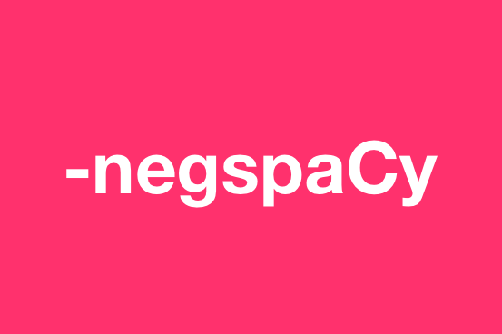

<p align="center"></p>

# negspacy: negation for spaCy

[](https://spacy.io)

spaCy pipeline object for negating concepts in text. Based on the NegEx algorithm.

*NegEx - A Simple Algorithm for Identifying Negated Findings and Diseasesin Discharge Summaries
Chapman, Bridewell, Hanbury, Cooper, Buchanan*

## Installation and usage
Install the library
```bash
pip install negspacy
```

Import library and spaCy.
```python
import spacy
from negspacy.negation import Negex
```

Load spacy language model. Add negspacy pipeline object. Filtering on entity types is optional.
```python
nlp = spacy.load("en_core_web_sm")
negex = Negex(nlp, ent_types=["PERSON","ORG"])
nlp.add_pipe(negex, last=True)
```

View negations
```python
doc = nlp("She does not like Steve Jobs but likes Apple products.")

for e in doc.ents:
	print(e.text, e._.negex)
```

```console
Steve Jobs True
Apple False
```

## Contributing
[contributing](https://github.com/jenojp/negspacy/blob/master/CONTRIBUTING.md)

## Authors
* Jeno Pizarro

## License
[license](https://github.com/jenojp/negspacy/blob/master/LICENSE.md)